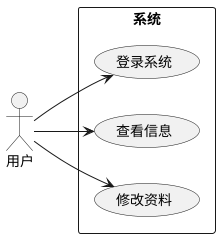
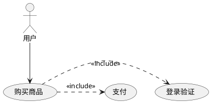

# OneWriter - 用例图生成服务使用说明

## 🚀 快速开始

### 1. 启动后端服务

```bash
# 进入后端目录
cd backend

# 安装依赖（使用uv）
uv pip install -r requirements.txt

# 启动服务
python api.py
```

后端服务将在 **http://localhost:8000** 启动

### 2. 启动前端服务

```bash
# 进入前端目录
cd frontend

# 启动开发服务器（如果还没启动）
pnpm dev
```

前端服务将在 **http://localhost:9000** 启动

## 📝 使用用例图功能

1. 在浏览器中访问 http://localhost:9000
2. 点击导航栏的 **"图表生成"** -> **"用例图"**
3. 在左侧输入框中输入 PlantUML 代码
4. 点击 **"生成用例图"** 按钮
5. 右侧将显示生成的图表

## 🎯 示例代码

### 基础示例


### 包含关系


## ⚠️ 注意事项

1. **必须先启动后端服务**，否则前端无法生成图表
2. 后端端口：**8000**
3. 前端端口：**9000**
4. 生成的图表保存在 `backend/generated_diagrams/` 目录

## 🔧 故障排除

### 问题：点击生成按钮后提示"请确保后端服务已启动"

**解决方案：**
1. 检查后端服务是否正在运行
2. 访问 http://localhost:8000/api/health 检查服务状态
3. 查看后端终端是否有错误信息

### 问题：后端启动失败

**解决方案：**
1. 确保已安装所有依赖：`uv pip install -r requirements.txt`
2. 检查端口8000是否被占用
3. 查看错误信息并安装缺失的依赖

## 📦 技术栈

- **后端**: Flask + PlantUML
- **前端**: Vue 3 + TypeScript + Element Plus
- **图表生成**: PlantUML 官方服务器

## 🎨 功能特性

- ✅ 实时生成 UML 用例图
- ✅ 支持中文
- ✅ 提供示例模板
- ✅ 图片下载功能
- ✅ 链接复制功能
- ✅ PlantUML 语法指南
