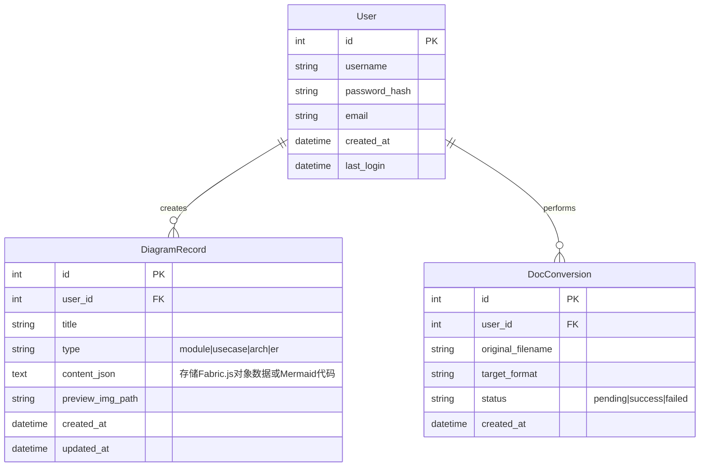

# One-Writer 项目架构规划

## 1. 技术栈概览

| 模块 | 技术选型 | 说明 |
| :--- | :--- | :--- |
| **前端框架** | **Vue 3** (Vite + TS) | 响应式核心，构建速度快 |
| **CSS 引擎** | **Tailwind CSS** | 构建高度定制化、高颜值的磨砂/渐变 UI |
| **UI 组件** | **Headless UI** + 手写组件 | 避免 ElementUI 的“系统感”，打造消费级产品质感 |
| **图形内核** | **Fabric.js** | 核心！架构图/ER图的每一个文字、框体都是独立对象 |
| **渲染内核** | **Mermaid.js** | 浏览器端直接渲染流程图、时序图 |
| **后端 API** | **Python FastAPI** | 极速接口，原生支持 PlantUML 脚本与文档处理 |
| **数据库** | **SQLite** | 单文件数据库，轻量高效，易备份 |
| **包管理** | **Pnpm** (前端), **uv** (后端) | 极速依赖安装与管理 |

---

## 2. 目录结构设计

```text
one-writer/
├── frontend/                # 前端工程 (Vue3 + Vite)
│   ├── src/
│   │   ├── assets/          # 静态资源 (图片、图标)
│   │   ├── components/      # 通用组件
│   │   │   ├── ui/          # 基础UI (Button, Card, Input - 玻璃态风格)
│   │   │   └── Layout.vue   # 全局布局 (导航 + 内容区)
│   │   ├── views/           # 页面视图
│   │   │   ├── dashboard/   # 首页工具大厅
│   │   │   ├── editor/      # 核心编辑器 (Canvas/代码双模式)
│   │   │   │   ├── FabricCanvas.vue  # 架构图编辑器 (Fabric.js)
│   │   │   │   └── CodePreview.vue   # 功能图编辑器 (PlantUML/Mermaid)
│   │   │   └── tools/       # 独立小工具 (文档转换、资源导航)
│   │   ├── composables/     # 组合式函数 (useFabric, useExport)
│   │   └── services/        # API 请求层
│   └── tailwind.config.js   # 视觉设计系统配置
│
├── backend/                 # 后端工程 (FastAPI)
│   ├── app/
│   │   ├── api/             # 路由接口
│   │   │   ├── diagrams.py  # 图表生成接口 (PlantUML)
│   │   │   └── docs.py      # 文档转换接口 (Pandoc)
│   │   ├── core/            # 核心业务逻辑
│   │   │   ├── renderers/   # 调用本地 Python 脚本生成图片
│   │   │   └── pandoc/      # 文档转换包装器
│   │   └── main.py          # 启动入口
│   ├── requirements.txt     # 依赖列表
│   └── data/                # SQLite 数据库文件 & 临时生成的图片
│
└── deploy/                  # 部署配置 (Docker / Nginx)
```

---

## 3. 核心功能实现路径

### 3.1 架构图编辑器 (The Visual Editor)
*   **技术**: `frontend/src/views/editor/FabricCanvas.vue`
*   **逻辑**:
    1.  初始化 Canvas，加载用户选择的模板图片作为背景。
    2.  封装 `addText()`, `addRect()` 方法，用户点击工具栏即向 Canvas 添加 Fabric 对象。
    3.  **丝滑交互**: Fabric.js 处理所有的拖拽、缩放、双击编辑文本。
    4.  **导出**: 调用 `canvas.toDataURL()` 直接在浏览器生成 PNG 下载。

### 3.2 功能模块图 / PlantUML 生成
*   **技术**: Frontend (Input) -> Backend (Subprocess)
*   **逻辑**:
    1.  前端左侧 Monaco Editor 输入文本。
    2.  前端发送 POST 请求到 FastAPI。
    3.  FastAPI 调用本地 `plantuml.jar` 或 Python 绘图库。
    4.  返回 Base64 图片数据，前端右侧即时展示。

### 3.3 文档转换 (Md ⇄ Word)
*   **技术**: Pandoc Pipeline
*   **逻辑**:
    1.  用户上传文件 / 粘贴 Markdown。
    2.  后端调用 `pypandoc` 库执行转换。
    3.  生成流文件返回给前端下载。

---

## 4. UI 设计语言 (Tailwind 配置预设)

为了达到“Wow”的效果，我们将定义一套 **"Deep Space"** 视觉系统：

*   **主色调 (Primary)**: `Indigo-600` (深邃紫蓝，科技感) -> `Violet-500` (渐变用)
*   **背景色 (Background)**: `Slate-900` (极深灰/黑，护眼且凸显内容)
*   **卡片 (Surface)**: `White/10` (10%透明度的白色，配合 `backdrop-filter: blur(12px)`)
*   **质感**: 所有的卡片添加 1px 的高亮边框 (`border-white/20`)，模拟玻璃边缘反光。

## 5. 开发步骤规划

1.  **Phase 1: 骨架搭建**
    *   初始化 Vue3 + Tailwind 项目。
    *   初始化 FastAPI 项目。
    *   配置前后端联调环境。

2.  **Phase 2: 核心 UI 系统**
    *   实现“玻璃态”首页与导航栏。
    *   构建基础 UI 组件 (Button, Card, Input)。

3.  **Phase 3: 架构图编辑器 (重难点)**
    *   集成 Fabric.js。
    *   实现背景切换、文本编辑、拖拽交互。
    *   实现图片导出。

4.  **Phase 4: 生成类工具**
    *   集成 Mermaid.js (前端直出)。
    *   集成 PlantUML 后端接口。

5.  **Phase 5: 资源与文档工具**
    *   资源导航页开发。
    *   文档转换接口对接。

## 6. 数据库 E-R 图设计 (SQLite)

本系统采用轻量级设计，主要包含以下核心实体：



### 实体说明
1.  **User (用户表)**: 存储基础用户信息。虽然是工具站，但保存用户历史记录还是很有必要的。
2.  **DiagramRecord (图表记录表)**: **最核心的表**。
    *   `content_json`: 对于架构图/ER图编辑器，这里直接存储 Fabric.js 导出的 JSON 对象（包含了所有文字的位置、颜色、大小等信息），实现**“再次编辑”**功能。
    *   `type`: 区分是普通的用例图（存代码）还是架构图（存Canvas对象）。
3.  **DocConversion (转换记录表)**: 记录用户的文档转换历史，主要用于统计和排查错误。

### 3.4 专题功能：数据库 E-R 图绘制 (实现方案)

该功能与架构图编辑器共享核心技术，但针对“E-R图”的特性进行专门优化。

*   **设计原理**: "底图模板 + 结构化图层覆盖"
    *   用户并非从零绘制线条，而是选择精美的预设模板（如：三线表模板、Crow's Foot 模板）。
    *   系统加载模板图片作为 Canvas 背景。
    *   系统自动在模板的关键位置生成 `可编辑文本框` (Fabric.IText)。

*   **数据结构 (Template Config)**:
    每一个 E-R 图模板不仅仅是一张 PNG，还包含一个坐标配置文件：
    ```json
    {
      "template_id": "er_001",
      "name": "经典三线表模型",
      "image_url": "/assets/templates/er_001.png",
      "default_elements": [
        { "type": "text", "left": 100, "top": 50, "content": "表名: 用户", "fontSize": 16 },
        { "type": "text", "left": 100, "top": 80, "content": "id (PK)\nusername\npassword", "fontSize": 14 }
      ]
    }
    ```

*   **操作流程**:
    1.  **选模板**: 用户在侧边栏点击“E-R图模板”。
    2.  **自动填充**: 画布加载背景，并根据 JSON 自动“撒”下预置的文本框。
    3.  **无感修改**: 用户双击文本框修改字段名和类型，无需手动对齐，系统已预设好行高和位置。
    4.  **导出**: 合成导出。
